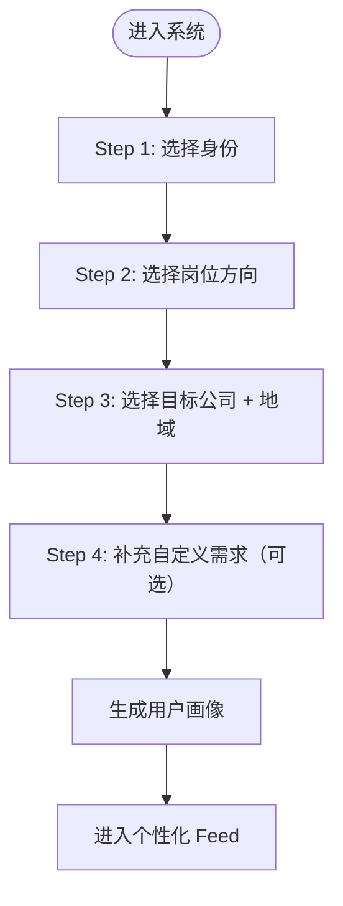
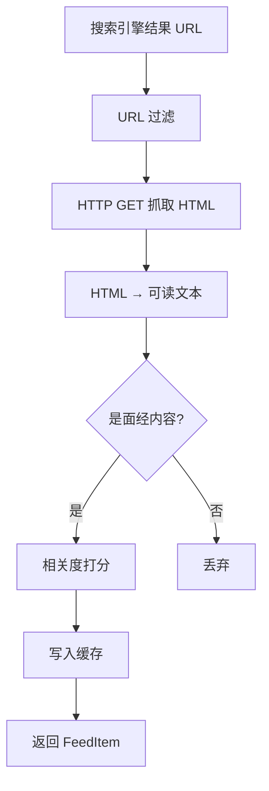
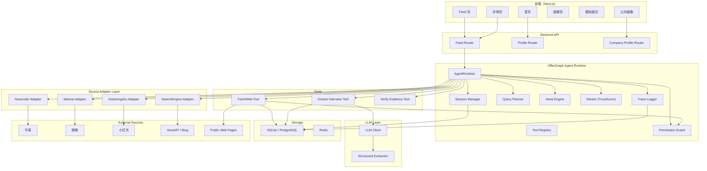
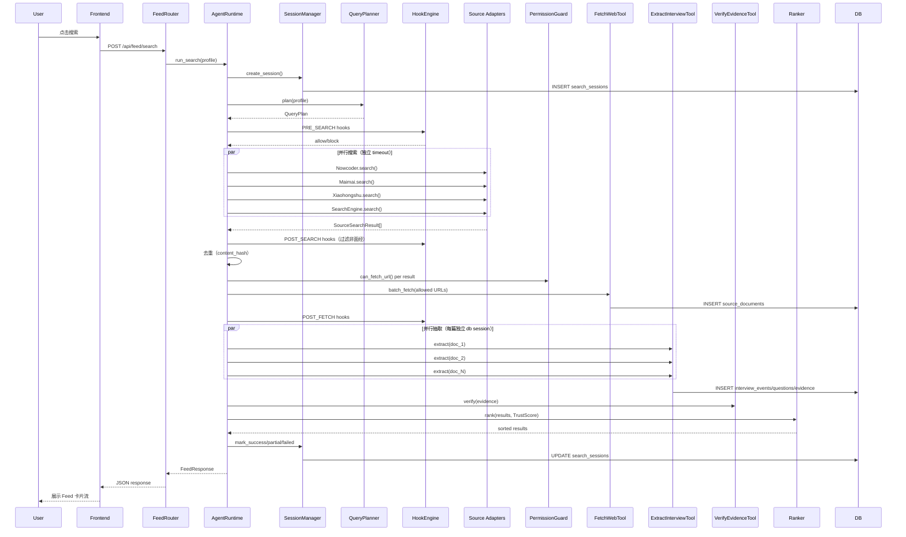
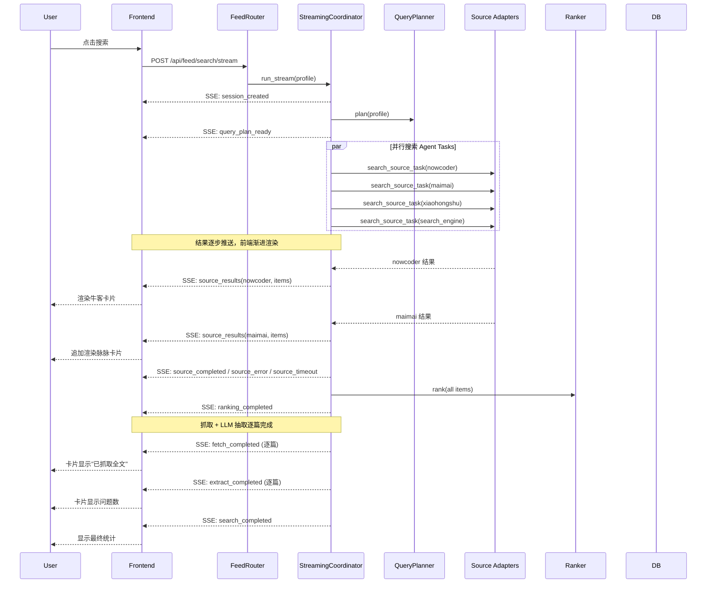
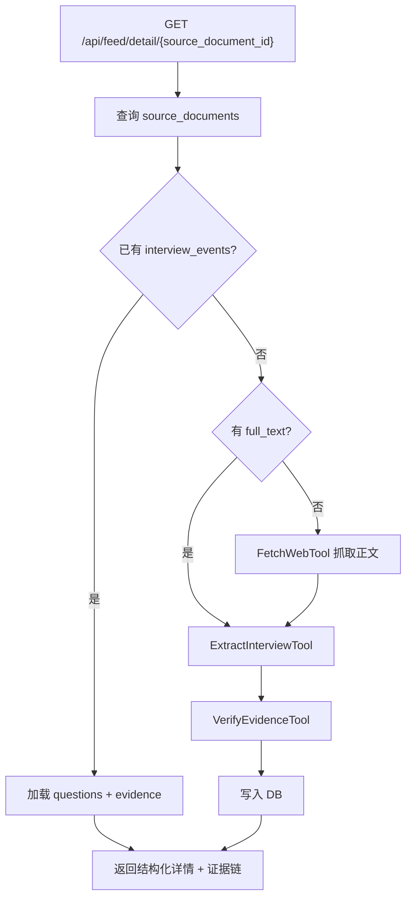
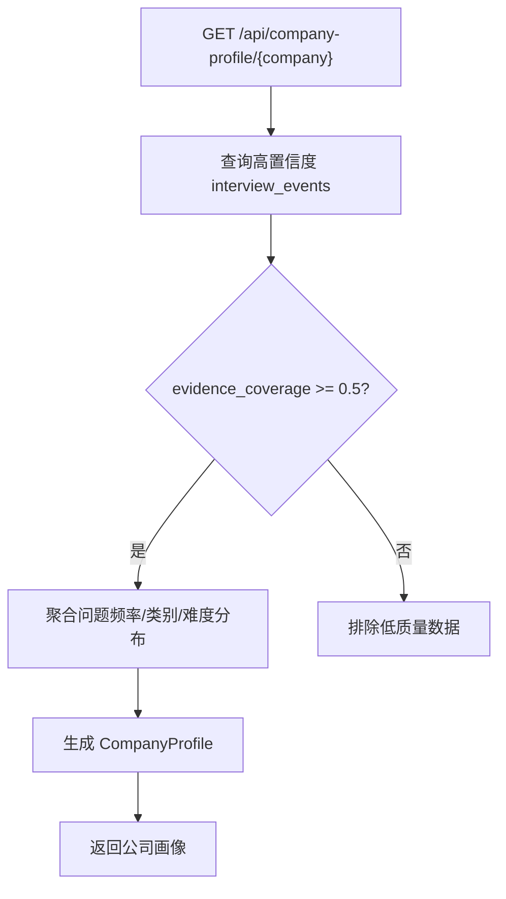

# PRD：OfferGraph / 面经雷达

> 文档版本：2.3  
> 状态：实施中  
> 最后更新：2026-06-07  
> 维护者：OfferGraph Team

---

## 1. 产品概述

### 1.1 产品名称

**OfferGraph** / 面经雷达

一句话定位：

> 选择目标公司和岗位，系统实时搜索全网面经并推送结构化内容，帮你知道真实会问什么、怎么追问、如何准备。

### 1.2 产品背景

求职者在准备面试时面临的核心问题：

1. **信息分散**：面经散落在牛客、脉脉、小红书、知乎、个人博客等十几个平台，手动搜集效率极低。
2. **时效性差**：收藏的面经很快过时，不知道目标公司最近在问什么。
3. **匹配困难**：在海量面经中找到"我的目标公司 + 我的目标岗位"相关内容非常耗时。
4. **无法行动**：看了面经也不知道自己哪里薄弱，缺少针对性的准备路径。

OfferGraph 解决的问题：

> 用户不应该花时间在各平台搜集面经，而是告诉系统"我要面哪家公司什么岗位"，系统实时搜索全网并把最相关的面试信息推送给他。

---

## 2. 产品目标

### 2.1 核心目标

通过引导式画像建立，让系统精准理解用户需求，然后实时搜索全网面经并推送最相关的内容。

### 2.2 完整闭环

1. 用户进入系统，通过 3-4 步引导完成画像建立。
2. 系统根据画像组合搜索词，实时并行搜索牛客、脉脉、小红书及搜索引擎。
3. 抓取搜索结果正文，过滤非面经内容。
4. 去重、按时间 + 内容质量排序，筛选 Top N。
5. 以个性化 Feed 形式展示。
6. 用户可查看详情、保存、直接进入模拟面试。
7. 系统基于累积数据生成公司面试画像。
8. 用户可随时修改画像，刷新 Feed 结果。

### 2.3 非目标

1. 不做全网定时后台爬取。
2. 不做用户 UGC 内容发布。
3. 不做社交/讨论/点赞等社区功能。
4. 不做简历投递自动化。
5. 不做付费内容抓取。

### 2.4 产品原则

1. **画像驱动**：先了解用户是谁、要什么，再做搜索推送。
2. **预设标签**：核心选项预设好，降低用户输入成本。
3. **实时搜索**：用户请求时才搜索，不预存全网数据。
4. **多源聚合**：同时查平台 API + 搜索引擎，不依赖单一来源。
5. **缓存加速**：相同画像短期内复用缓存，避免重复请求。
6. **降级友好**：单个数据源失败不阻塞整体，展示可用结果。

---

## 3. 目标用户

### 3.1 用户 A：在校学生（校招 / 实习）

背景：大三大四或研究生，准备秋招/春招/实习。

特征：
- 项目经验少，高度依赖面经。
- 对行业认知有限，需要引导。
- 有明确的目标公司但不确定具体岗位细分。

### 3.2 用户 B：职场人（社招 / 跳槽）

背景：有 1-10 年工作经验，准备跳槽。

特征：
- 有明确技术栈和方向。
- 关注特定公司特定 level 的面试风格。
- 时间有限，需要高效获取最相关信息。

### 3.3 用户 C：转行 / 转方向

背景：从传统开发转 AI、从测试转开发等。

特征：
- 对新方向的面试要求不熟悉。
- 需要了解目标方向的知识结构。
- 对自身短板缺乏认知。

核心共同特征：**不想自己去各平台搜集面经，告诉系统"我是谁、要去哪"，系统直接推送最相关信息。**

---

## 4. 用户画像引导（Onboarding）

### 4.1 引导流程

用户首次进入系统，通过 3-4 步引导建立画像。完成后进入个性化 Feed。



### 4.2 Step 1：身份选择

预设选项：

| 选项 | 说明 |
|------|------|
| 在校学生 - 秋招 | 应届生秋招 |
| 在校学生 - 春招 | 应届生春招补录 |
| 在校学生 - 暑期实习 | 大三暑期实习 |
| 在校学生 - 日常实习 | 非暑期实习 |
| 职场人 - 跳槽 | 在职社招 |
| 职场人 - 转方向 | 在职转换赛道 |

UI：卡片式单选，每个选项一张卡片，图标 + 标题 + 一行描述。

### 4.3 Step 2：岗位方向

预设标签（支持多选）：

**技术类：**
- 后端开发
- 前端开发
- 客户端开发（iOS/Android）
- 测试开发
- 数据开发 / 大数据
- AI 应用开发 / Agent 工程
- 算法工程师（推荐/搜索/NLP/CV）
- 运维 / SRE / DevOps
- 安全工程师
- 嵌入式 / IoT

**非技术类：**
- 产品经理
- 数据分析师
- 项目管理

UI：标签网格，可多选，选中高亮。

### 4.4 Step 3：目标公司 + 地域

**目标公司（多选，最多 5 家）：**

预设热门公司分组：
- 大厂：字节跳动、阿里巴巴、腾讯、美团、京东、百度、华为、小红书
- AI 公司：商汤、旷视、智谱、月之暗面、MiniMax、DeepSeek
- 外企：Google、Microsoft、Amazon、Apple
- 其他：支持用户输入自定义公司名

**地域（可选，单选或多选）：**
- 北京
- 上海
- 深圳
- 杭州
- 广州
- 成都
- 南京
- 不限

UI：公司区域用 Tag 选择器 + 搜索框，地域用 Checkbox 组。

### 4.5 Step 4：自定义需求（可选）

自由文本输入框，让用户补充系统预设标签未覆盖的需求。

示例 placeholder：
> 比如：我主要做 RAG 和 Agent 方向，想重点看这方面的面经；或者：我想看 P7/高级工程师 level 的面试题

字符限制：500 字。

系统会将自定义需求作为搜索词的一部分参与搜索。

### 4.6 用户画像数据结构

```typescript
type UserProfile = {
  id: string;
  identity: "student_autumn" | "student_spring" | "student_summer_intern"
            | "student_daily_intern" | "working_switch" | "working_pivot";
  directions: string[];       // 岗位方向（多选）
  targetCompanies: string[];  // 目标公司（最多 5 家）
  regions: string[];          // 目标地域
  customNeeds: string | null; // 自定义需求文本
  createdAt: string;
  updatedAt: string;
};
```

### 4.7 画像 → 搜索词映射

系统根据画像自动生成搜索词组合：

```
对于 targetCompanies 中的每个 company:
  对于 directions 中的每个 direction:
    搜索词 = "{company} {direction} 面经"
    搜索词 = "{company} {direction} 面试"

如果有 customNeeds:
  追加搜索词 = "{company} {customNeeds关键词}"

如果有 identity == student_*:
  追加修饰 = "校招" / "实习"
如果 identity == working_*:
  追加修饰 = "社招"
```

### 4.8 画像修改

- 用户可以随时在设置页或 Feed 顶部修改画像。
- 修改后 Feed 立即刷新。
- 历史画像保留，支持切换（如准备多家公司）。

### 4.9 验收标准

1. 新用户进入系统后 30s 内能完成画像建立（3-4 步）。
2. 每步选项清晰、无歧义，不需要额外说明。
3. 选项覆盖 90% 以上的主流技术求职场景。
4. 自定义需求输入框位置明显，不会被跳过。
5. 完成画像后自动进入 Feed，无需额外操作。
6. 修改画像后 Feed 5s 内刷新。

---

## 5. 核心使用场景

### 5.1 场景一：首次使用 → 建立画像 → 看 Feed

用户操作：
1. 打开 OfferGraph。
2. 选择"职场人 - 跳槽"。
3. 选择"后端开发"。
4. 选择"字节跳动""美团"，地域选"北京"。
5. 自定义需求写"重点看系统设计和项目深挖"。
6. 完成，进入 Feed。

用户看到：个性化 Feed，标题显示"基于你的画像：字节跳动/美团 · 后端 · 社招 · 北京"

```
─────────────────────────────────────
[牛客] 字节跳动后端二面面经 - 2026.05
  "问了 Redis 一致性、分布式锁、项目中的
   高并发处理方案，最后手撕 LRU..."
  Redis · 分布式 · 系统设计
  → 查看详情 | 保存 | 模拟面试
─────────────────────────────────────
[脉脉] 美团后端社招一面
  "项目深挖为主，追问了系统设计中的
   高可用方案，最后一道 BFS..."
  系统设计 · 高可用
  → 查看详情 | 保存 | 模拟面试
─────────────────────────────────────
[博客] 我的字节跳动后端面试全流程
  "一共四轮，一面基础+算法，二面项目
   深挖，三面系统设计，HR面..."
  全流程 · 系统设计
  → 查看详情 | 保存 | 模拟面试
─────────────────────────────────────
来源状态：✓牛客 ✓脉脉 ⚠小红书(超时) ✓搜索引擎
共 48 条结果 · 耗时 3.2s · [修改画像]
```

### 5.2 场景二：面经详情

用户点击某张卡片"查看详情"：

展示内容：
- 来源平台 + 原文链接
- 面试信息：公司、岗位、轮次、时间
- 面试问题列表（结构化提取）
- 技术标签
- 难度评估
- "用这些问题开始模拟面试"按钮

### 5.3 场景三：从面经直接模拟面试

用户在 Feed 中看到一篇面经，点击"模拟面试"：

系统行为：
1. 从该面经提取的问题作为面试题目。
2. 按面经中的轮次和追问顺序进行。
3. 对用户回答实时评价。
4. 面试结束后生成短板报告和复习建议。

### 5.4 场景四：修改画像 → Feed 刷新

用户在 Feed 页点击"修改画像"：
- 新增一家目标公司"阿里"。
- 追加方向"AI 应用开发"。
- 保存后 Feed 立即刷新，新增阿里 + AI 方向的面经内容。

### 5.5 场景五：公司面试画像

系统基于画像中的目标公司自动聚合生成画像：

```
字节跳动 / 后端开发 / 社招

近 30 天采集量：47 篇
高频标签：Redis、分布式、系统设计、MySQL、算法
面试风格：项目深挖 + 八股 + 手撕算法，整体难度中上
高频问题：
1. Redis 和数据库一致性怎么保证？（出现 12 次）
2. 分布式锁有哪些实现方案？（出现 9 次）
3. 项目中高并发是怎么处理的？（出现 8 次）
```

---

## 6. 功能模块

### 6.1 模块一：用户画像引导

详见第 4 章。画像数据驱动后续所有搜索和推荐行为。

---

### 6.2 模块二：实时搜索 Feed

#### 6.2.1 功能说明

系统根据用户画像自动组合搜索词，实时从多个数据源搜索面经相关内容，聚合后以卡片流展示。

#### 6.2.2 数据源

| 数据源 | 搜索方式 | 内容类型 | 优先级 |
|--------|---------|---------|--------|
| 牛客 | Search API（关键词搜索） | 面经帖子 | 高 |
| 脉脉 | Search API（关键词搜索） | 职场动态 | 高 |
| 小红书 | MCP 协议（Playwright 浏览器自动化） | 笔记 | 中 |
| 搜索引擎 | SerpAPI / Bing API | 全网博客、论坛 | 中（兜底） |
| 本地缓存 | 数据库查询 | 历史搜索结果 | 高（即时） |

#### 6.2.3 搜索词构造（基于画像自动生成）

系统采用**分层广泛查询策略**，从精确到宽泛逐级展开，确保命中率：

```yaml
# 系统根据画像自动组合，用户无需手动输入搜索词
# 示例：画像={identity: working_switch, directions: [后端开发], companies: [字节跳动, 美团]}

# 分层策略：精确 → 宽泛 → 跨公司
platform_queries:
  # P0: 公司 + 方向 + 时效（最精确，带年份保证新鲜度）
  - "字节跳动 后端开发 面经 2025"
  - "美团 后端开发 面经 2025"
  # P1: 公司 + 面经（宽泛兜底，不限方向）
  - "字节跳动 面经"
  - "美团 面经"
  # P2: 公司 + 方向 + 面试
  - "字节跳动 后端开发 面试"
  - "美团 后端开发 面试"
  # P3: 方向 + 面经（跨公司，扩大覆盖面）
  - "后端开发 面经 最新"

search_engine_queries:
  - "字节跳动 后端 面经 site:nowcoder.com OR site:maimai.cn"
  - "美团 后端 面试经验"
```

**查询策略设计原则**：
- 不再使用身份标签（社招/校招）拼接查询词，避免过度精确导致 0 结果
- 每家公司至少生成 3 条不同粒度的查询
- 必须包含跨公司的方向查询，覆盖同行业面经
- 带年份或"最新"关键词保证时效性

#### 6.2.4 Feed 卡片数据结构

```typescript
type FeedItem = {
  id: string;
  source: "nowcoder" | "maimai" | "xiaohongshu" | "web";
  sourceUrl: string;
  title: string;
  snippet: string;
  company: string | null;
  position: string | null;
  publishedAt: string | null;
  relevanceScore: number;
  tags: string[];
  hasFullText: boolean;
};

type FeedResponse = {
  items: FeedItem[];
  total: number;
  query: { company: string; position: string; candidateType?: string };
  sourcesStatus: Record<string, "ok" | "timeout" | "error" | "disabled">;
  cachedCount: number;
  freshCount: number;
  searchDuration: number;
};
```

#### 6.2.5 超时与降级策略

- 每个数据源独立超时：平台 API 5s，搜索引擎 8s，WebFetch 10s。
- 单个源超时不阻塞响应，返回已获取的结果 + 源状态提示。
- 本地缓存 < 100ms 先返回，后台继续搜索新结果。

#### 6.2.6 验收标准

1. 画像建立完成后 5s 内看到至少 5 条结果。
2. 结果来自至少 2 个不同数据源。
3. 结果与画像中的公司+岗位+身份高度相关。
4. 每条结果有来源标识、标题、摘要、标签。
5. 数据源异常时有明确状态提示，不白屏。

---

### 6.3 模块三：WebFetch 正文抓取

#### 6.3.1 功能说明

对搜索引擎返回的 URL，实时抓取正文内容并判断是否为面经。

#### 6.3.2 处理流程



#### 6.3.3 抓取约束

- 单次搜索最多 WebFetch 10 个 URL。
- 单页面最大 500KB。
- 超时 10s 放弃。
- 尊重 robots.txt。
- 不抓取需要登录的页面。

---

### 6.4 模块四：Feed 缓存

#### 6.4.1 功能说明

将实时搜索结果缓存到数据库，相同查询短期内直接返回缓存。

#### 6.4.2 缓存策略

- 缓存 key：`normalize(company) + normalize(position)`
- 缓存有效期：24 小时
- 24h 内再次查询：先返回缓存，后台异步刷新
- 缓存去重：content_hash
- 缓存淘汰：30 天未访问自动清理

#### 6.4.3 数据表

```sql
CREATE TABLE user_profiles (
  id TEXT PRIMARY KEY,
  identity TEXT NOT NULL,
  directions_json TEXT NOT NULL,
  target_companies_json TEXT NOT NULL,
  regions_json TEXT,
  custom_needs TEXT,
  created_at DATETIME DEFAULT CURRENT_TIMESTAMP,
  updated_at DATETIME DEFAULT CURRENT_TIMESTAMP
);
```

```sql
CREATE TABLE feed_cache (
  id TEXT PRIMARY KEY,
  query_company TEXT NOT NULL,
  query_position TEXT NOT NULL,
  query_key TEXT NOT NULL,
  source TEXT NOT NULL,
  source_url TEXT NOT NULL,
  title TEXT,
  snippet TEXT,
  full_text TEXT,
  content_hash TEXT UNIQUE,
  tags_json TEXT,
  published_at DATETIME,
  relevance_score REAL,
  fetched_at DATETIME NOT NULL,
  last_accessed_at DATETIME,
  access_count INTEGER DEFAULT 1,
  created_at DATETIME DEFAULT CURRENT_TIMESTAMP
);

CREATE INDEX idx_feed_cache_query ON feed_cache(query_key, fetched_at DESC);
CREATE INDEX idx_feed_cache_hash ON feed_cache(content_hash);
```

---

### 6.5 模块五：面经详情与结构化

#### 6.5.1 功能说明

用户点击 Feed 卡片后，展示面经的结构化内容。

#### 6.5.2 结构化提取

系统使用 LLM 从面经正文中提取：

```typescript
type StructuredInterview = {
  company: string | null;
  position: string | null;
  candidateType: "social" | "campus" | "intern" | "unknown";
  round: string | null;
  interviewDate: string | null;
  questions: InterviewQuestion[];
  tags: string[];
  difficulty: 1 | 2 | 3 | 4 | 5;
  summary: string;
};

type InterviewQuestion = {
  text: string;
  category: "project" | "fundamentals" | "algorithm" | "system_design" | "ai" | "behavioral" | "other";
  followUps: string[];
};
```

#### 6.5.3 验收标准

1. 用户点击 Feed 卡片后 3s 内看到结构化内容。
2. 面试问题列表准确率可接受。
3. 每道问题有分类标签。
4. 有"用这些问题模拟面试"入口。

---

### 6.6 模块六：公司面试画像

#### 6.6.1 功能说明

基于 Feed 缓存中的累积数据，为公司+岗位生成面试画像。

#### 6.6.2 画像内容

- 近期采集样本数量
- 高频技术标签 Top N
- 高频面试问题 Top N
- 面试风格总结（LLM 生成）
- 难度分布
- 来源平台分布

#### 6.6.3 生成条件

- 缓存中该公司+岗位的面经数量 >= 5 条时才生成画像。
- 不足 5 条时提示"样本不足，持续搜索中"。

---

### 6.7 模块七：简历分析与个性化追问

#### 6.7.1 功能说明

用户上传简历后，系统结合目标公司画像生成个性化追问。

#### 6.7.2 输入

- 简历文本（Markdown / 粘贴）
- 目标公司
- 目标岗位

#### 6.7.3 输出

- 用户技能标签
- 项目风险点
- 结合目标公司高频题的个性化追问（20+）
- 每道追问标注来源类型：真实面经 / AI 拓展
- 回答建议

---

### 6.8 模块八：模拟面试

#### 6.8.1 功能说明

用户可以从 Feed 面经或公司画像进入模拟面试。

#### 6.8.2 题目来源

1. 当前面经中提取的问题。
2. 该公司岗位的画像高频题。
3. LLM 基于上下文生成的追问。

#### 6.8.3 面试流程

1. 8-12 个问题。
2. 每个问题最多 3 层追问。
3. 用户回答后即时评价（0-100 分）。
4. 面试结束后生成总评 + 短板分析。
5. 生成 7 天复习计划。

#### 6.8.4 评价维度

- 是否命中核心点
- 是否有项目经验支撑
- 是否有工程落地意识
- 是否能处理边界情况
- 表达是否清晰

---

## 7. API 设计

### 7.1 用户画像

#### POST /api/profile

创建或更新用户画像。

Request:
```json
{
  "identity": "working_switch",
  "directions": ["后端开发"],
  "targetCompanies": ["字节跳动", "美团"],
  "regions": ["北京"],
  "customNeeds": "重点看系统设计和项目深挖"
}
```

Response:
```json
{
  "id": "profile_xxx",
  "identity": "working_switch",
  "directions": ["后端开发"],
  "targetCompanies": ["字节跳动", "美团"],
  "regions": ["北京"],
  "customNeeds": "重点看系统设计和项目深挖",
  "createdAt": "2026-06-06T21:00:00Z"
}
```

#### GET /api/profile

获取当前用户画像。

#### PATCH /api/profile

修改画像部分字段。

---

### 7.2 Feed 搜索

#### POST /api/feed/search

基于画像搜索面经 Feed。如果传入 profileId 则使用该画像；否则使用请求体中的条件。

Request:
```json
{
  "profileId": "profile_xxx",
  "page": 1,
  "pageSize": 20
}
```

Response:
```json
{
  "items": [
    {
      "id": "feed_xxx",
      "source": "nowcoder",
      "sourceUrl": "https://www.nowcoder.com/feed/...",
      "title": "字节跳动后端二面面经",
      "snippet": "问了 Redis 一致性、分布式锁...",
      "company": "字节跳动",
      "position": "后端开发",
      "publishedAt": "2026-05-20",
      "relevanceScore": 0.92,
      "finalScore": 0.87,
      "trustLabel": "high",
      "hasFullText": true,
      "tags": ["Redis", "分布式", "系统设计"]
    }
  ],
  "total": 35,
  "sourcesStatus": {
    "nowcoder": "ok",
    "maimai": "ok",
    "xiaohongshu": "timeout",
    "web": "ok"
  },
  "qualityReport": {
    "fetchedCount": 15,
    "evidenceCoverageAvg": 0.72
  },
  "cachedCount": 12,
  "freshCount": 23,
  "searchDuration": 3200,
  "sessionId": "session_xxx"
}
```

#### POST /api/feed/search/stream（流式 SSE）

基于画像实时流式搜索面经 Feed。使用 Server-Sent Events (SSE) 协议，搜索结果逐步推送到前端，无需等待全部完成。

Request: 同 `POST /api/feed/search`

Response: `text/event-stream`

事件流：

```
1. session_created     → {session_id}
2. phase_start          → {phase: "planning"|"searching"|"fetching"|"extracting"|"ranking"}
3. query_plan_ready    → {queries: [...], active_sources: [...]}
4. search_started       → {source: "nowcoder", queries: [...]}  (每个 source 一条)
5. source_results       → {source: "nowcoder", items: FeedItem[]}  (渐进推送)
6. source_completed     → {source: "nowcoder", count: N, duration_ms: N}
7. source_error         → {source: "xiaohongshu", error: "..."}
8. source_timeout       → {source: "maimai", timeout_s: N}
9. ranking_completed    → {final_items: FeedItem[], total: N}
10. fetch_completed     → {source_url, source_document_id, has_full_text: bool}
11. extract_completed   → {source_document_id, question_count: N, evidence_coverage, tags}
12. search_completed    → {session_id, total, search_duration_ms, sources_status, status}
13. search_error        → {error: "..."}
14. search_blocked      → {reason: "..."}
```

请求示例：
```bash
curl -N -X POST http://127.0.0.1:8000/api/feed/search/stream \
  -H "Content-Type: application/json" \
  -d '{"identity":"working_switch","directions":["后端开发"],"target_companies":["字节跳动"],"regions":["北京"]}'
```

#### GET /api/feed/search-sessions/{id}

查询搜索会话详情（审计用途）。

Response:
```json
{
  "id": "session_xxx",
  "status": "partial_success",
  "queryPlan": { "queries": [...] },
  "sourcesStatus": { "nowcoder": "ok", "xiaohongshu": "timeout" },
  "searchCount": 35,
  "fetchCount": 15,
  "extractCount": 12,
  "duration": 4200,
  "qualityReport": { "fetchedCount": 15, "evidenceCoverageAvg": 0.72 },
  "createdAt": "2026-06-06T21:00:00Z"
}
```

#### GET /api/feed/detail/{source_document_id}

获取单条 Feed 详情，包含结构化面经和证据链。

Response:
```json
{
  "id": "doc_xxx",
  "source": "nowcoder",
  "sourceUrl": "...",
  "title": "字节跳动后端二面面经",
  "fullText": "...",
  "structured": {
    "company": "字节跳动",
    "position": "后端开发",
    "round": "二面",
    "questions": [
      {
        "text": "Redis 和 MySQL 怎么保证一致性？",
        "category": "fundamentals",
        "difficulty": 3,
        "sourceType": "real_interview",
        "evidence": [
          {
            "quote": "面试官问了 Redis 和数据库的一致性方案",
            "startOffset": 120,
            "endOffset": 155,
            "verified": true
          }
        ],
        "followUps": ["延迟双删了解吗？", "MQ 消息丢了怎么办？"]
      }
    ],
    "tags": ["Redis", "分布式锁", "高并发"],
    "difficulty": 3,
    "summary": "二面偏工程，重点考察缓存和并发处理",
    "evidenceCoverage": 0.85
  }
}
```

#### GET /api/feed/cached

仅查询缓存（无网络请求，< 100ms），基于画像中的条件。

Query: `?profileId=profile_xxx&limit=20`

---

### 7.3 公司画像

#### GET /api/company-profile/{company}

Query: `?position=后端开发&candidateType=social`

Response:
```json
{
  "company": "字节跳动",
  "position": "后端开发",
  "sampleCount": 47,
  "highConfidenceCount": 32,
  "topTags": ["Redis", "分布式", "MySQL", "系统设计", "算法"],
  "topQuestions": [
    { "text": "Redis 和数据库一致性怎么保证？", "frequency": 12 },
    { "text": "分布式锁有哪些实现方案？", "frequency": 9 }
  ],
  "styleSummary": "项目深挖 + 八股 + 手撕算法，难度中上",
  "difficultyAvg": 3.5,
  "sourcesDistribution": { "nowcoder": 22, "maimai": 15, "web": 10 },
  "categoryDistribution": {
    "fundamentals": 0.35,
    "system_design": 0.25,
    "algorithm": 0.20,
    "project_deep_dive": 0.15,
    "behavioral": 0.05
  },
  "evidenceCoverageAvg": 0.78
}
```

---

### 7.4 简历与个性化

#### POST /api/resume/analyze

Request:
```json
{
  "resumeText": "...",
  "targetCompany": "字节跳动",
  "targetPosition": "后端开发"
}
```

Response:
```json
{
  "skills": ["Python", "Redis", "MySQL", "Docker", "FastAPI"],
  "projects": [
    {
      "name": "分布式爬虫系统",
      "risks": ["缺少高并发场景", "没有提到监控方案"],
      "likelyQuestions": ["爬虫的去重策略？", "如何保证数据一致性？"]
    }
  ],
  "personalizedQuestions": [
    {
      "text": "你的爬虫系统如何处理目标站点的反爬？",
      "sourceType": "ai_extension",
      "reason": "结合简历项目和字节反爬相关面试题",
      "difficulty": 3
    }
  ]
}
```

---

### 7.5 模拟面试

#### POST /api/mock-interviews

创建一场模拟面试。

Request:
```json
{
  "company": "字节跳动",
  "position": "后端开发",
  "candidateType": "social",
  "feedItemIds": ["feed_xxx", "feed_yyy"],
  "mode": "real_questions_first"
}
```

#### POST /api/mock-interviews/{id}/answer

提交回答。

#### POST /api/mock-interviews/{id}/finish

结束面试，生成报告。

---

## 8. 页面设计

### 8.1 引导页 /onboarding（首次进入）

分步引导，每步一个全屏卡片。底部有进度条和"下一步"按钮。

```
┌──────────────────────────────────────────┐
│                Step 1 / 4                 │
│                                          │
│   你是？                                  │
│                                          │
│   ┌──────────┐  ┌──────────┐            │
│   │  在校学生  │  │  职场人   │            │
│   │  秋招     │  │  跳槽     │            │
│   └──────────┘  └──────────┘            │
│   ┌──────────┐  ┌──────────┐            │
│   │  在校学生  │  │  职场人   │            │
│   │  暑期实习  │  │  转方向   │            │
│   └──────────┘  └──────────┘            │
│   ┌──────────┐  ┌──────────┐            │
│   │  在校学生  │  │          │            │
│   │  日常实习  │  │          │            │
│   └──────────┘  └──────────┘            │
│                                          │
│           ●○○○    [下一步 →]              │
└──────────────────────────────────────────┘
```

```
┌──────────────────────────────────────────┐
│                Step 2 / 4                 │
│                                          │
│   你的目标岗位方向？（可多选）             │
│                                          │
│   [后端开发] [前端开发] [客户端]          │
│   [测试开发] [数据开发] [AI应用/Agent]    │
│   [算法工程师] [运维/SRE] [安全]          │
│   [产品经理] [数据分析]                    │
│                                          │
│           ○●○○    [← 上一步] [下一步 →]   │
└──────────────────────────────────────────┘
```

```
┌──────────────────────────────────────────┐
│                Step 3 / 4                 │
│                                          │
│   目标公司？（最多选 5 家）                │
│                                          │
│   大厂：                                  │
│   [字节] [阿里] [腾讯] [美团] [小红书]    │
│   AI：                                    │
│   [智谱] [月之暗面] [DeepSeek] [商汤]     │
│   [+ 输入其他公司...]                      │
│                                          │
│   目标地域（可选）：                       │
│   [北京] [上海] [深圳] [杭州] [不限]      │
│                                          │
│           ○○●○    [← 上一步] [下一步 →]   │
└──────────────────────────────────────────┘
```

```
┌──────────────────────────────────────────┐
│                Step 4 / 4                 │
│                                          │
│   还有什么特别想了解的？（可跳过）         │
│                                          │
│   ┌────────────────────────────────────┐ │
│   │ 比如：我主要做 RAG 和 Agent 方向，  │ │
│   │ 想重点看这方面的面经；或者：想看     │ │
│   │ P7 级别的面试题...                   │ │
│   └────────────────────────────────────┘ │
│                                          │
│           ○○○●    [← 上一步] [开始搜索 →] │
└──────────────────────────────────────────┘
```

### 8.2 Feed 页 /feed（核心页面）

画像建立后自动跳转。采用左右分栏布局：左侧 Agent 活动面板（1/4），右侧流式卡片（3/4）。

搜索结果通过 SSE 流式推送，卡片渐进出现（带 fadeIn 动画），无需等待全局加载完成。

顶部显示当前画像摘要、搜索状态统计和修改画像/重新搜索入口。

```
┌──────────────────────────────────────────────────────────────┐
│  实时搜索                                                     │
│  基于你的画像：字节跳动 / 后端 · 社招                          │
│                                    [修改画像] [重新搜索]      │
├────────────────┬─────────────────────────────────────────────┤
│                │  ✓牛客 ✓脉脉 ⚠小红书(超时) ✓搜索引擎        │
│                │  ┌──────┐ ┌──────┐ ┌──────┐ ┌──────┐      │
│                │  │搜索中│ │48 条 │ │72%  │ │48/0  │      │
│  Agent 活动    │  │ ...  │ │面经  │ │覆盖率│ │新鲜度│      │
│                │  └──────┘ └──────┘ └──────┘ └──────┘      │
│  ┌──────────┐  │                                             │
│  │规划搜索   │  │  ┌─────────────────────────────────────┐   │
│  │(spinning) │  │  │ [牛客] 字节跳动后端二面面经          │   │
│  └──────────┘  │  │ 2026-05-20 · 相关度 92% · 已抓取全文  │   │
│                │  │ "问了 Redis 一致性、分布式锁..."       │   │
│  ┌──────────┐  │  │                           8 题       │   │
│  │牛客搜索   │  │  └─────────────────────────────────────┘   │
│  │✓ 12条 1.2s│  │                                             │
│  └──────────┘  │  ┌─────────────────────────────────────┐   │
│                │  │ [脉脉] 美团后端社招一面 (fadeIn)      │   │
│  ┌──────────┐  │  │ 2026-05-18 · 相关度 88%              │   │
│  │脉脉搜索   │  │  │ "项目深挖为主，系统设计方案..."       │   │
│  │● running  │  │  └─────────────────────────────────────┘   │
│  └──────────┘  │                                             │
│                │  ┌─────────────────────────────────────┐   │
│  ┌──────────┐  │  │ [搜索引擎] 面经博客 (fadeIn)         │   │
│  │搜索引擎   │  │  │ ...                                 │   │
│  │○ idle     │  │  └─────────────────────────────────────┘   │
│  └──────────┘  │                                             │
│                │                                             │
│  找到面经      │                                             │
│  48 条         │                                             │
│  总耗时 3.2s   │                                             │
└────────────────┴─────────────────────────────────────────────┘
```

Agent 状态图标：
- ● spinning = 运行中 (running)
- ✓ = 完成 (done)
- ✗ = 错误 (error)
- ⏱ = 超时 (timeout)
- ○ = 等待中 (idle)

卡片渐进增强：
1. 搜索完成时：显示标题、来源、摘要、相关度
2. 抓取完成时：显示"已抓取全文"标识
3. 抽取完成时：显示问题数量（"N 题"）

### 8.3 详情页 /feed/{id}

- 来源平台 + 原文链接
- 结构化面试信息
- 提取的问题列表（带分类标签）
- "用这些问题模拟面试"
- "保存到我的收藏"

### 8.4 公司画像页 /profiles/{company}

- 高频技术标签词云
- 高频问题列表（带出现频次）
- 面试风格总结
- 近期趋势
- 来源分布

### 8.5 简历分析页 /resume

- 粘贴/上传简历
- 选择目标公司和岗位
- 展示技能分析、项目风险点
- 个性化追问列表

### 8.6 模拟面试页 /mock/{id}

- 聊天式交互
- 每道题显示来源标签（真实面经 / AI 追问）
- 实时评分
- 结束后报告 + 复习计划

---

## 9. 系统架构

### 9.1 整体架构



### 9.2 Agent Runtime 核心组件

| 组件 | 职责 |
|------|------|
| **AgentRuntime** | 主编排引擎，串联搜索全流程 |
| **SessionManager** | 创建/更新 SearchSession，管理状态 |
| **QueryPlanner** | 根据用户画像生成搜索查询计划 |
| **ToolRegistry** | 工具注册中心 |
| **PermissionGuard** | 搜索/抓取前权限检查（登录页、付费页、robots.txt） |
| **HookEngine** | 质量门禁（PRE_SEARCH / POST_SEARCH / POST_FETCH / POST_EXTRACT） |
| **Ranker** | TrustScore 多维度排序 |
| **TraceLogger** | 运行轨迹审计（tool_runs 写入） |
| **StreamingCoordinator** | 流式协调器，管理 SSE 事件流和 Agent Task 并行调度 |

### 9.3 调用链

**非流式路径（POST /api/feed/search）：**

```
POST /api/feed/search
→ FeedRouter
→ AgentRuntime.run_search(profile)
→ SessionManager.create_session()
→ QueryPlanner.plan(profile) → QueryPlan
→ HookEngine.PRE_SEARCH
→ asyncio.gather(SourceAdapters...) [独立 timeout, 单源容错]
→ HookEngine.POST_SEARCH
→ 去重
→ PermissionGuard.can_fetch_url()
→ FetchWebTool → source_documents
→ HookEngine.POST_FETCH
→ asyncio.gather(ExtractInterviewTool...) [每篇独立 db session，并行 LLM 调用]
→ VerifyEvidenceTool → evidence_coverage
→ Ranker.rank() [TrustScore]
→ SessionManager.mark_success/partial_success/failed
→ TraceLogger.log_tool_run()
→ FeedResponse
```

**流式路径（POST /api/feed/search/stream）：**

```
POST /api/feed/search/stream
→ FeedRouter
→ StreamingResponse(StreamingCoordinator.run_stream(profile))
→ StreamingCoordinator:
    1. yield session_created
    2. QueryPlanner.plan() → yield query_plan_ready
    3. asyncio.wait(搜索 tasks) → 各 task 向 queue push 事件:
       - search_started → source_results → source_completed/error/timeout
       → 主循环从 queue 消费并 yield SSE
    4. Ranker.rank() → yield ranking_completed
    5. asyncio.wait(抓取 tasks) → yield fetch_completed (逐篇)
    6. asyncio.gather(抽取 tasks, 每篇独立 db session) → yield extract_completed (逐篇)
    7. yield search_completed
→ 前端 fetch + ReadableStream 消费 SSE → 渐进渲染卡片 + Agent 活动面板
```

### 9.4 TrustScore 排序算法（时间+质量优先）

排序以**时效性**和**内容丰富度**为主要因子，确保最近发布且内容详细的面经排在最前：

```
final_score =
  freshness * 0.35              # 时效性（最重要）
  + content_richness * 0.30     # 内容丰富度
  + source_reliability * 0.15   # 来源可信度
  + evidence_coverage * 0.10    # 证据覆盖（LLM 抽取后）
  + duplicate_support * 0.05    # 多篇支持
  + extraction_confidence * 0.05 # 抽取置信度
```

#### 硬性时间过滤

在排序前，先过滤掉超过 `max_content_age_days`（默认 180 天）的内容：

- 优先使用 `published_at` 字段判断时间
- 其次从标题/snippet 中提取日期
- 最后从相对时间提示（如 "3天前"）推断
- **无法判断时间的内容保留**（降级处理，避免误杀）

配置项：
- `max_content_age_days`: 最大内容年龄（天），默认 180（6 个月）

#### 排序与截取

排序完成后截取 **Top N**（默认 `ranking_top_n=15`）。

#### 时效性评分 (freshness)

多来源推断，优先级从高到低：
1. `published_at` 字段（API 返回的发布时间）
2. 标题/snippet 中的日期文本（如 "2025年6月"）
3. 相对时间提示（如 "昨天"、"3天前"）
4. 标题中的年份（如 "2025"）

| 时间范围 | 分数 |
|---------|------|
| 6 个月内 | 1.0（权重一致） |
| 6 个月 - 1 年 | 0.5 |
| 1-2 年 | 0.2 |
| 超过 2 年 | 0.05 |

#### 内容丰富度评分 (content_richness)

基于标题和摘要的关键词密度评估面经内容价值：
- 命中关键词：面经、一面/二面/三面、算法题、手撕、八股、全流程、详细、已offer 等
- 标题长度加分（信息量指标）
- 摘要长度加分

#### 来源可信度

| 来源 | 可信度 |
|------|--------|
| 牛客 | 0.9 |
| 脉脉 | 0.7 |
| 知乎 | 0.7 |
| 掘金 | 0.65 |
| 小红书 | 0.6 |
| 搜索引擎 | 0.6 |

### 9.5 数据模型

| 表 | 用途 |
|----|------|
| `user_profiles` | 用户画像（身份、方向、目标公司、地区、需求） |
| `feed_cache` | Feed 搜索结果缓存 |
| `search_sessions` | 搜索会话记录（状态、QueryPlan、来源状态、耗时、质量报告） |
| `tool_runs` | 工具调用审计（tool_name、status、duration、input/output） |
| `source_documents` | 来源文档（URL、标题、正文、content_hash、fetch_policy） |
| `interview_events` | 面试经历（公司、岗位、轮次、difficulty、evidence_coverage） |
| `interview_questions` | 结构化问题（source_type: real_interview/ai_extension） |
| `question_evidence` | 证据链（quote、start_offset、end_offset） |

### 9.6 技术栈

| 层次 | 技术 |
|------|------|
| 前端 | Next.js + React + Tailwind CSS + shadcn/ui |
| 后端 | FastAPI + Python 3.11+ |
| Agent Runtime | 自研编排引擎 |
| 数据库 | SQLite（开发）/ PostgreSQL（生产） |
| 缓存 | Redis |
| HTTP 客户端 | httpx（async） |
| LLM | OpenAI-compatible API |
| 搜索引擎 | SerpAPI |
| 平台适配器 | Nowcoder / Maimai / Xiaohongshu (MCP) / SearchEngine |

### 9.7 设计约束

1. **真实来源优先**：所有面试问题必须能追溯到来源，AI 拓展题必须标记 `source_type: ai_extension`
2. **不长期保存网页全文**：full_text 建议 TTL 7 天，长期保存结构化数据
3. **Agent Runtime 负责决策，Service 负责业务封装**：FeedService 不直接调用平台 API
4. **工具调用必须可审计**：每次搜索/抓取/抽取/排序写入 tool_runs
5. **单源容错**：使用 `asyncio.gather(return_exceptions=True)`，单个来源失败不阻断整体
6. **证据链完整**：real_interview 问题的 evidence_coverage >= 0.5 才能进入公司画像统计

---

## 10. 数据处理流程

### 10.1 实时搜索流程（Agent Runtime）

**非流式路径（POST /api/feed/search）：**



**流式路径（POST /api/feed/search/stream）：**



### 10.2 详情获取流程



### 10.3 公司画像生成流程



---

## 11. 配置

```yaml
# offergraph.yaml / .env

# 搜索引擎
SEARCH_API_PROVIDER=serpapi      # serpapi / bing
SEARCH_API_KEY=xxx
SEARCH_RESULTS_PER_QUERY=10

# 平台
NOWCODER_ENABLED=true
MAIMAI_ENABLED=true
XHS_ENABLED=true

# 超时
SEARCH_TIMEOUT_PLATFORM_SEC=5
SEARCH_TIMEOUT_SEARCH_ENGINE_SEC=8
WEBFETCH_TIMEOUT_SEC=10
WEBFETCH_MAX_URLS=10

# 缓存
FEED_CACHE_TTL_HOURS=24
FEED_CACHE_MAX_AGE_DAYS=30

# LLM
LLM_API_BASE=https://api.openai.com/v1
LLM_API_KEY=xxx
LLM_MODEL=gpt-4o-mini

# Redis
REDIS_URL=redis://localhost:6379/0
```

---

## 12. 里程碑

### Phase 1：画像引导 + 搜索 MVP

目标：用户完成引导建立画像，看到 Feed 结果。

任务：
1. 前端 Onboarding 引导页（4 步）
2. 用户画像 API + 数据模型
3. 画像 → 搜索词映射逻辑
4. SearchOrchestrator 服务（并行调度 + 聚合）
5. 平台适配器包装为搜索接口（牛客、脉脉）
6. Feed 缓存层
7. POST /api/feed/search API
8. 前端 Feed 页面基本 UI

验收：完成 4 步引导后 5s 内看到基于画像的面经卡片。

---

### Phase 2：搜索引擎 + WebFetch 兜底

目标：通过搜索引擎覆盖长尾公司。

任务：
1. 接入 SerpAPI / Bing Search API
2. WebFetch 正文抓取
3. 面经内容过滤 + 相关度打分
4. 小红书适配器接入

验收：搜索小众公司时，通过搜索引擎返回博客面经。

---

### Phase 3：详情 + LLM 结构化

目标：点击 Feed 卡片看到结构化面试问题。

任务：
1. 详情 API + 前端页面
2. LLM 面经结构化提取
3. 问题列表 + 标签展示

验收：点击卡片后看到提取出的面试问题列表。

---

### Phase 4：公司画像

目标：基于累积缓存数据生成画像。

任务：
1. 画像聚合逻辑
2. 高频问题统计
3. 面试风格 LLM 总结
4. 画像页面 UI

验收：搜索同一公司多次后，能看到该公司的面试画像。

---

### Phase 5：模拟面试

目标：从 Feed 直接进入模拟面试。

任务：
1. 模拟面试 API
2. 从面经提取的问题作为题源
3. LLM 评价 + 追问
4. 面试报告页

验收：用户从一篇面经开始模拟面试，完成后看到报告。

---

### Phase 6：简历分析 + 个性化

目标：简历 + 目标公司 → 个性化追问。

任务：
1. 简历分析 API
2. 结合画像生成个性化追问
3. 简历分析页面 UI

验收：上传简历后看到个性化问题列表。

---

## 13. 风险与对策

| 风险 | 影响 | 对策 |
|------|------|------|
| 搜索 API 额度限制 | 超额后无法搜索 | 24h 缓存大幅减少请求；超额降级只返回平台结果 |
| 平台 Cookie 过期 | 单平台不可用 | 该源标记 disabled，不影响其他源；提供 Cookie 更换工具 |
| WebFetch 被拒 | 部分网页无法抓取 | 尊重 robots.txt；超时放弃；搜索引擎作为兜底 |
| 搜索结果含非面经 | 干扰用户 | 关键词过滤 + 相关度打分；低分排后或不展示 |
| LLM 提取不准确 | 结构化错误 | 保留原文链接，用户可跳转验证；置信度标注 |
| 响应太慢 | 用户流失 | 缓存优先；超时降级；渐进加载 |

---

## 14. 成功指标

| 指标 | 目标 |
|------|------|
| 画像引导完成率 | > 80% |
| 引导平均耗时 | < 30s |
| 搜索成功率（主流公司） | > 90% |
| 平均搜索耗时 | < 5s |
| Feed 卡片点击率 | > 30% |
| Feed → 模拟面试转化率 | > 10% |
| 次日回访率 | > 20% |

---

## 15. LLM 使用规范

系统中 LLM 用于：
1. 面经正文结构化提取（问题、标签、难度）。
2. 公司画像风格总结。
3. 个性化追问生成。
4. 模拟面试追问。
5. 回答评价。
6. 短板报告和复习计划。

LLM 不得：
1. 编造面试来源。
2. 将 AI 拓展题伪装成真实面经题。
3. 编造用户简历中不存在的经历。
4. 在样本不足时给确定性结论。
5. 使用歧视性或过度主观的评价。

---

## 变更记录

| 日期 | 版本 | 变更内容 |
|------|------|---------|
| 2026-06-08 | 2.6 | 前端全量优化 — Radar Intelligence 视觉方向：(1) 首页重写，去掉 AI SaaS 模板感，改为雷达扫描风格；(2) Feed 卡片从网格改为列表项风格，信息密度更高；(3) ActivityLog 改为 console/terminal 风格；(4) 全局色彩从 emerald 改为 cyan 色系；(5) 新增 radar-grid 背景、radar-sweep/scan-line 动画；(6) TrustBadge 改为色条风格 |
| 2026-06-08 | 2.5 | LLM 抽取并行化：AgentRuntime._safe_batch_extract 和 _batch_extract 从串行 for 循环改为 asyncio.gather 并行执行，每篇文档使用独立 db session 避免 SQLite 锁竞争；更新 9.3 节调用链和 10.1 节时序图 |
| 2026-06-07 | 2.4 | 排序优化 - 硬性时间过滤：(1) 新增 max_content_age_days 配置（默认 180 天），超过此天数的内容在排序前直接过滤；(2) 调整时间衰减曲线，1 年内 0.15、1-2 年 0.05、超 2 年 0.01；(3) 无法判断时间的内容保留（降级处理）；(4) 更新 9.4 节 TrustScore 算法说明 |
| 2026-06-07 | 2.3 | 搜索质量与排序优化：(1) TrustScore 排序重构为时间+内容质量优先（freshness 35% + content_richness 30%），新增 Top N 截断（默认 15）；(2) QueryPlanner 改为分层广泛查询策略，带时效关键词，避免过度精确导致 0 结果；(3) 小红书适配器从 Web SSR 改为 MCP 协议（Playwright 浏览器自动化 + 真实会话）；(4) 新增配置项 ranking_top_n、xhs_mcp_command；调整 search_timeout_platform=60s、webfetch_timeout=30s |
| 2026-06-07 | 2.2 | 多 Agent 流式搜索架构：新增 POST /api/feed/search/stream SSE 端点；新增 StreamingCoordinator 流式协调器组件；新增前端 SSE 客户端 (stream-api.ts)、AgentActivity 面板、StreamingFeed 组件；重构 Feed 页为左右分栏流式布局；卡片支持渐进增强（抓取→已抓取全文、抽取→N 题）；更新 7.2/8.2/9.2/9.3/10.1 章节 |
| 2026-06-06 | 2.1 | Agent Runtime 架构改造：新增 9.2-9.7 节（Runtime 组件/调用链/TrustScore/数据模型/设计约束）；更新 API 7.2-7.3（新增 sessionId/trustLabel/finalScore/evidenceCoverage/search-sessions）；更新 10.1-10.3 数据处理流程（Agent Runtime 时序图、证据链详情流程、公司画像生成流程） |
| 2026-06-06 | 2.0 | 初版 PRD：实时搜索 Feed + 多源聚合 + 模拟面试 |
