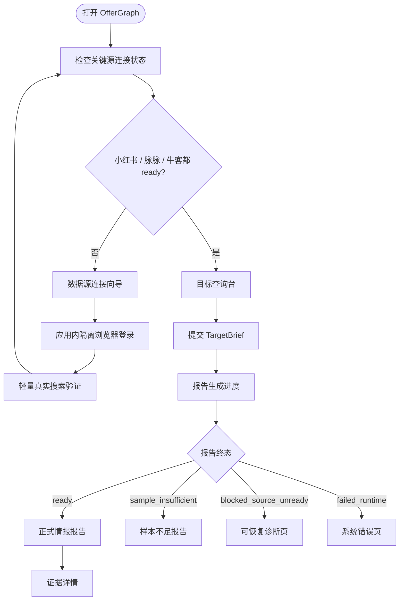
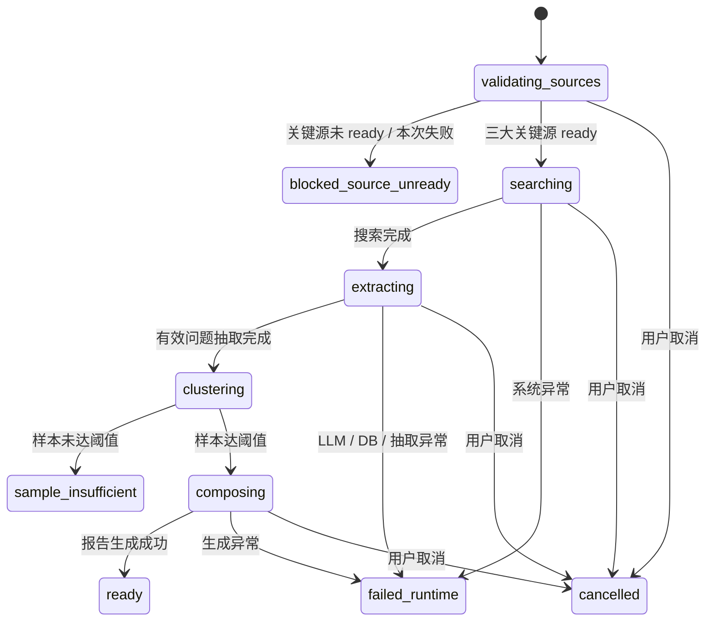
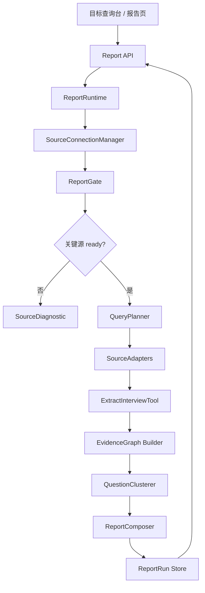

# OfferGraph 设计优化方案

> 状态：设计决策稿  
> 日期：2026-07-02  
> 目标：将 OfferGraph 从“画像驱动 Feed”收敛为“目标公司/岗位面试情报雷达”

---

## 1. 设计结论

OfferGraph 第一版应收敛为一个可信、可追溯的面试情报工具，而不是泛 AI 求职助手。

核心体验从：

```text
用户画像 → 实时 Feed → 详情 / 模拟面试
```

调整为：

```text
数据源连接 → 目标查询台 → 报告生成进度 → 情报报告 → 证据详情
```

一句话定位：

> 用户输入目标公司、岗位方向、经验阶段后，系统基于小红书、脉脉、牛客等关键源生成一份可信、近期、可追溯的面试情报报告。

---

## 2. 目标与非目标

### 2.1 目标

- 让已有明确目标公司的技术岗求职者快速知道目标岗位近期真实会问什么。
- 用证据链支撑所有真实问题、问题簇和趋势判断。
- 将登录态平台作为核心数据源，而不是可有可无的增强源。
- 把数据源失败、样本不足、系统异常拆成不同产品状态。
- 让每次报告成为可复查、可重新扫描、可比较版本的 `ReportRun`。

### 2.2 非目标

- 第一版不以模拟面试为主体验。
- 第一版不以简历分析为主体验。
- 第一版不做泛职业规划、岗位推荐或从零转行学习路径。
- 不做云端账号池，不托管平台账号。
- 不用公开网页结果替代关键登录态源生成正式报告。

---

## 3. 核心用户

第一版锁定：**已有明确目标公司的技术岗求职者**。

典型输入：

- 公司：字节跳动 / 美团 / 阿里 / 小红书
- 岗位方向：后端开发 / 前端开发 / AI 应用开发 / 算法工程师
- 经验阶段：实习 / 校招 / 社招

这类用户的问题最尖锐：

> 我要面某家公司某个方向，最近真实面试在问什么，我该优先准备什么？

---

## 4. MVP 主流程

### 4.1 用户流程



### 4.2 MVP 验收线

MVP 只交付一条完整闭环：

1. 首次打开先检查三大关键源连接状态。
2. 三源 ready 后进入目标查询台。
3. 用户输入公司、岗位方向、经验阶段。
4. 系统展示报告生成进度。
5. 报告包含样本质量摘要、问题簇、近期来源、准备建议。
6. 每个问题簇都能展开看到真实问题和证据引用。
7. 关键源失败时进入诊断页，不生成正式报告。
8. 样本不足时展示不足状态，不输出确定性趋势或准备结论。

---

## 5. 信息架构

### 5.1 首页 / 数据源连接向导

第一屏不直接搜索。系统先检查关键源：

- 小红书
- 脉脉
- 牛客

每个源展示：

- 当前状态：未连接 / ready / 过期 / 限流 / 验证码 / 超时 / 解析异常
- 上次验证时间
- 主动作：连接 / 重新登录 / 重新验证
- 高级动作：手动导入 Cookie

### 5.2 目标查询台

必填：

- 目标公司
- 岗位方向
- 经验阶段

可选：

- 地域
- 时间窗口
- 重点主题

查询台不再表现为“画像建立”，而是一次目标情报扫描。

### 5.3 报告页

报告页不是 Feed，而是情报报告。建议固定为四层：

1. 雷达摘要：样本数量、来源覆盖、时间窗口、可靠性提示。
2. 高频问题簇：按主题聚类展示真实问题。
3. 近期真实面经：作为证据列表展示来源、时间、匹配度、题目数。
4. 准备建议：AI 基于证据簇生成，但不新增事实。

---

## 6. 证据规则

### 6.1 事实层

进入正式报告事实层的内容必须满足：

- 真实问题必须来自原文。
- `real_interview` 问题必须有 `evidence_quote` 和来源 URL。
- 问题簇至少需要 2 条真实问题或 2 个来源支撑，才可展示为高频/趋势。
- 单来源问题可以展示，但只能标为“单条样本”。
- 默认主报告只使用近 6 个月样本，更老内容放入历史参考。

### 6.2 建议层

AI 可以生成准备建议，但必须遵守：

- 每条建议必须关联至少一个 `QuestionCluster`。
- 不得新增事实。
- 不得把 AI 推断伪装成真实面经。
- 样本不足时，不输出确定性准备结论。

---

## 7. 关键源策略

### 7.1 MVP 关键源

MVP 将以下源定义为关键源：

- 小红书
- 脉脉
- 牛客

搜索引擎和公开网页是辅助源，可以补充证据，但不能替代关键源生成正式报告。

### 7.2 双门禁规则

正式报告必须通过两道门禁：

1. 关键源门禁：小红书、脉脉、牛客都必须 ready，并且本次都参与搜索。
2. 样本门禁：至少 5 篇有效面经、至少 2 个关键平台有有效样本、至少 8 条真实问题证据。

不满足时：

- 关键源失败：`blocked_source_unready`，进入诊断页。
- 样本不足：`sample_insufficient`，展示已有证据和补充建议，但不生成正式趋势。

### 7.3 连接方式

主连接方式：应用内隔离浏览器会话。

备用方式：手动导入 Cookie，只放在高级入口。

安全边界：

- 不读取用户系统浏览器资料。
- 不做云端账号池。
- 不托管平台账号。
- Cookie / session 只本地保存。
- 凭证不进入业务数据库、日志、测试快照或报告导出。

### 7.4 Ready 标准

关键源 ready 不能只看“有 Cookie”。必须满足：

- 本地存在该源隔离会话状态。
- 会话能访问平台搜索页或接口。
- 用低风险关键词完成一次轻量真实搜索。
- 状态可区分：可用、未登录、验证码/风控、限流、超时、解析异常、无结果。
- 最近验证时间不超过 24 小时。
- 报告生成前再次复验。

---

## 8. 核心数据模型

### 8.1 TargetBrief

一次目标情报查询。

```typescript
type TargetBrief = {
  id: string;
  company: string;
  roleDirection: string;
  experienceStage: "intern" | "campus" | "social";
  region?: string | null;
  timeWindowDays: number;
  focusTopics: string[];
};
```

### 8.2 EvidenceSource

一条来源文档。

```typescript
type EvidenceSource = {
  id: string;
  source: "xiaohongshu" | "maimai" | "nowcoder" | "web";
  sourceUrl: string;
  title: string;
  publishedAt: string | null;
  fetchedAt: string;
  healthStatus: string;
  trustScore: number;
};
```

### 8.3 InterviewQuestion

从来源中抽取出的真实问题。

```typescript
type InterviewQuestion = {
  id: string;
  sourceType: "real_interview" | "ai_extension";
  text: string;
  category: string;
  confidence: number;
  evidenceQuote: string | null;
  evidenceSourceId: string;
};
```

### 8.4 QuestionCluster

问题簇，用于报告主展示。

```typescript
type QuestionCluster = {
  id: string;
  title: string;
  category: string;
  questionIds: string[];
  sourceCount: number;
  evidenceCount: number;
  isTrendQualified: boolean;
};
```

### 8.5 IntelligenceReport

最终情报报告。

```typescript
type IntelligenceReport = {
  id: string;
  targetBriefId: string;
  status: ReportStatus;
  sampleQuality: SampleQuality;
  sourceSnapshot: SourceHealthSnapshot[];
  clusters: QuestionCluster[];
  sources: EvidenceSource[];
  preparationAdvice: PreparationAdvice[];
  createdAt: string;
};
```

### 8.6 ReportRun

每次生成的可复查报告工件。

```typescript
type ReportRun = {
  id: string;
  targetBrief: TargetBrief;
  status: ReportStatus;
  reportVersion: string;
  sourceHealthSnapshot: SourceHealthSnapshot[];
  sampleQuality: SampleQuality;
  intelligenceReport?: IntelligenceReport;
  createdAt: string;
  completedAt?: string | null;
};
```

---

## 9. 报告状态机



终态：

- `ready`：正式报告可展示。
- `sample_insufficient`：关键源成功，但样本不足。
- `blocked_source_unready`：关键源未 ready 或本次失败。
- `failed_runtime`：系统错误。
- `cancelled`：用户取消或新查询覆盖旧查询。

---

## 10. 后端模块架构

### 10.1 新主链路



### 10.2 模块职责

#### SourceConnectionManager

- 管理小红书、脉脉、牛客的连接状态。
- 提供 connect、validate、check、getReadyContext。
- 输出统一健康状态和失败原因。

#### SourceConnection

- 每个关键源一个实现。
- 管理隔离浏览器会话、轻量搜索验证、会话刷新。

#### ReportGate

- 在报告生成前检查关键源门禁。
- 判断是否允许进入正式搜索。
- 输出 `blocked_source_unready` 的诊断信息。

#### ReportRuntime

- 新主编排模块。
- 输入 `TargetBrief`，输出 `ReportRun` 事件和最终报告。
- 复用现有 Adapter、QueryPlanner、FetchTool、ExtractInterviewTool、Ranker 等底层能力。

#### QuestionClusterer

- 将真实问题聚类为问题簇。
- 判断每个簇是否满足趋势展示资格。

#### ReportComposer

- 生成雷达摘要、样本质量、准备建议。
- AI 只基于证据簇生成建议，不新增事实。

---

## 11. SSE 事件语义

现有流式搜索偏 Feed 语义，建议改为报告构建语义。

建议事件：

- `report_run_created`
- `source_validation_started`
- `source_validation_completed`
- `source_blocked`
- `search_started`
- `source_search_completed`
- `evidence_extraction_started`
- `evidence_found`
- `cluster_ready`
- `sample_quality_ready`
- `report_ready`
- `report_sample_insufficient`
- `report_failed`
- `report_cancelled`

前端视觉焦点应是“情报构建中”，不是“实时刷卡片”。

---

## 12. 失败与诊断设计

关键源失败时，不展示普通错误页，而是展示可恢复诊断页。

诊断页应包含：

- 哪个关键源失败。
- 失败类型：未登录、会话过期、验证码/风控、限流、超时、解析异常。
- 本次影响：报告无法生成，因为关键源未参与。
- 恢复动作：重新登录、重新验证、稍后重试、查看源健康检查。
- 已成功源状态：命中数可以展示，但标注“未生成正式报告”。
- 重试动作：修复后继续同一个 `TargetBrief`。

---

## 13. 报告持久化与复用

### 13.1 持久化策略

每次报告生成一个 `ReportRun`。

长期保存：

- `TargetBrief`
- 报告状态
- 源健康快照
- 样本质量
- 问题簇
- 真实问题
- 证据引用
- 来源 URL、发布时间、平台、置信度

短期保存：

- 原始抓取正文，建议 TTL 7 天。

永不保存：

- Cookie
- 请求头
- 私有页面完整 HTML
- 用户登录态信息

### 13.2 复用策略

- 同一 `TargetBrief` 24 小时内已有 `ready` 报告时，默认展示最近报告。
- 页面顶部显示生成时间、样本时间窗、关键源参与情况。
- 用户点击“重新扫描”时创建新的 `ReportRun`，不覆盖旧版本。
- 旧报告为 `sample_insufficient` 或 `blocked_source_unready` 时，不自动视为可用报告。

---

## 14. 从现有架构迁移

### 14.1 保留

- 保留现有 `/api/feed/search` 和 `/api/feed/search/stream`。
- 保留现有 Adapter、抓取、抽取、证据链、排序能力。
- 保留 Feed 作为证据列表或旧入口。

### 14.2 新增

- `SourceConnection` 模块。
- 牛客连接与健康检查。
- `ReportRuntime`。
- `TargetBrief`、`ReportRun`、`IntelligenceReport` 相关 schema / model。
- 报告生成 SSE 事件。
- 目标查询台、报告页、诊断页。

### 14.3 降级

- Onboarding 不再是主入口。
- Feed 不再是主交付物。
- 模拟面试、简历分析从 MVP 主链路移到后续能力。

---

## 15. 推荐实施顺序

1. PRD 同步：将本方案合并进 `PRD.md`，形成 v3 主方向。
2. 数据源连接：抽出 `SourceConnectionManager`，补齐牛客连接状态。
3. 报告门禁：实现三关键源 ready 检查和诊断状态。
4. 核心模型：新增 `TargetBrief`、`ReportRun`、`QuestionCluster`、`IntelligenceReport`。
5. ReportRuntime：复用现有搜索/抽取能力生成报告状态机。
6. 前端主路径：数据源连接向导 → 目标查询台 → 报告页。
7. 样本质量与证据规则：落实双门禁和 AI 建议约束。
8. 旧 Feed 迁移：将 Feed 降为证据列表视图。

---

## 16. 待进一步拆解的问题

- 应用内隔离浏览器会话在 Electron 与 Web 开发模式下如何统一。
- 牛客是否必须登录，还是可先采用公开搜索 + 关键源健康抽象。
- `QuestionClusterer` 第一版使用规则聚类、embedding 聚类，还是 LLM 聚类。
- 报告版本对比是否进入 MVP。
- 证据引用是否需要支持截图或 DOM 定位。
- 登录态会话文件的本地安全存储实现方案。

