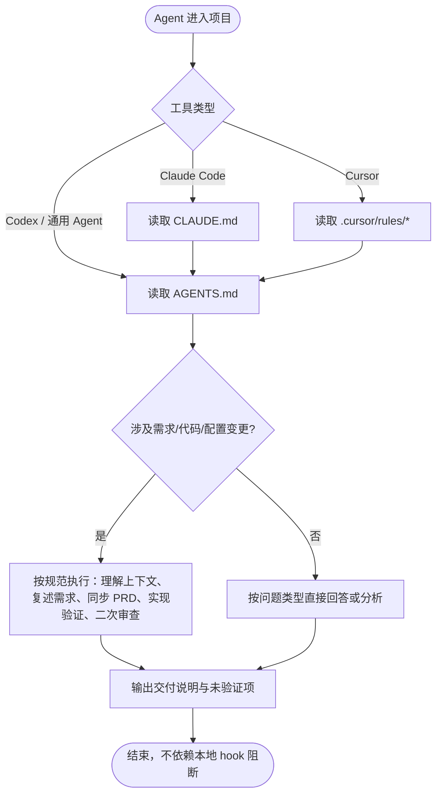

# AI Agent 工作流

本文记录 OfferGraph 项目的 AI 工具协作策略。

---

## 1. 工具入口

| 工具 | 入口文件 | 说明 |
|------|---------|------|
| Codex | `AGENTS.md` | 直接读取统一规范 |
| Claude Code | `CLAUDE.md` → `AGENTS.md` | 先读入口，再进入统一规范 |
| Cursor | `.cursor/rules/*` | 通过 `.mdc` 规则文件读取 |

## 2. 规范分发原则

跨工具规范写入以下文件，由各工具 Agent 读取后执行：

- `AGENTS.md` — 统一开发规范（任务分级、编码规则、测试、审查、交付格式）
- `CLAUDE.md` — Claude Code 入口与 skills/agents 索引
- `.cursor/rules/*` — Cursor 项目规则（自动生效）

## 3. Hooks 策略

本项目**不依赖本地 AI 工具 hooks 作为硬门禁**。

`.claude/settings.json` 和 `.codex/hooks.json` 默认不注册 `UserPromptSubmit` / `Stop` 硬阻断。

`scripts/ai_guards/*` 仅作为可选诊断脚本或 CI 候选能力：

| 脚本 | 用途 |
|------|------|
| `scripts/ai_guards/check_prd_sync.py` | 检查 PRD 是否需要同步 |
| `scripts/ai_guards/verify_touched_areas.py` | 根据改动文件建议验证命令 |
| `scripts/ai_guards/inject_workflow_context.py` | 可选生成流程上下文提示 |
| `scripts/ai_guards/validate_before_stop.py` | 可选检查交付说明完整性 |

## 4. 为什么不用硬门禁

硬门禁容易造成：

- 本地路径不一致导致工具无法启动
- 多工具行为不一致
- 用户输入被误拦截
- 对话结束被脚本阻断
- 维护成本高

本项目采用**文档规范 + 测试验证 + 二次审查 + CI 候选检查**的方式管理 AI 开发质量。

## 5. 规范分发流程

## 6. 异常处理

- Agent 未读取规范：最终交付中必须指出风险，并回到 `AGENTS.md` 补齐流程。
- 本地仍存在旧 hook 配置：应删除或置空 `.claude/settings.json`、`.codex/hooks.json` 中的项目级 hooks。
- 需要自动化校验：优先放入 CI 或手动命令清单；本地 hook 只能作为非阻断提醒。

## 7. 业务规则

1. `AGENTS.md` 是跨工具统一规范源。
2. `CLAUDE.md` 只作为 Claude Code 入口和 skills/agents 索引。
3. Cursor 通过 `.cursor/rules/*` 承载项目规则。
4. Codex 主要读取 `AGENTS.md`。
5. AI 工具 hook 与业务 Runtime `HookEngine` 必须在文档中明确区分，避免混淆。

---

## 变更记录

| 日期 | 变更内容 |
|------|---------|
| 2026-06-12 | 初始版本，从 PRD.md 11.1 节迁出 |
